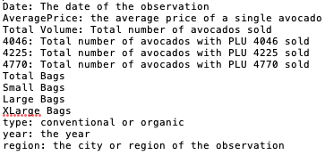
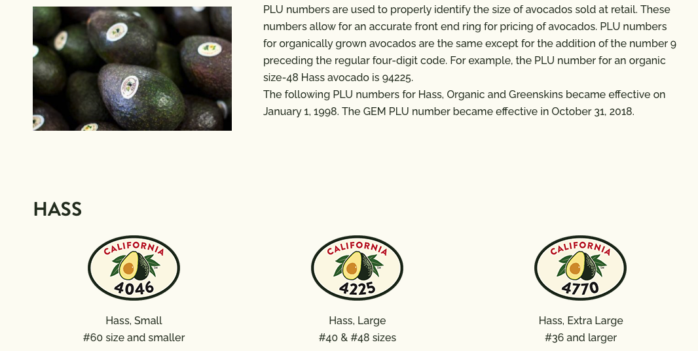

---
output:
  html_document:
    code_folding: hide
  html_notebook: default
  pdf_document: default
---

# Avocado data


```{r, warning = F, message = F}
library(tidyverse)
library(janitor)
library(lubridate)
library(leaps)

```

## Data checks
I'm struggling to understand the "volume" figures in the data:

`total_volume` is the sum of `x4046 + x4225 + x4770 + small_bags + large_bags + x_large_bags` for about 2/3 of records, but for the other 1/3 the total is out by around 38k

I'm going to ignore this for the moment and carry on, as the model is not using volume.


However, I'm  not happy with the clean dataset I've created - feels like I should be using avcado PMU size (4046, 4225 & 4770 columns) as a predictor, but can't see how to.


```{r, warning = F, message = F}
# Read in raw data
avocado <- read_csv("data_raw/avocado.csv") %>% 
  clean_names()

# Check for NAs
#avocado %>% 
#  summarise(across(.fns = ~sum(is.na(.))))

# Get PMU + bags total
avocado_totals <- avocado %>% 
  mutate(total_pmu_plus_bags = (x4046 + 
                                   x4225 + 
                                   x4770 +
                                   small_bags +
                                   large_bags +
                                   x_large_bags)
  ) %>% 
  select(total_volume,
         total_pmu_plus_bags,
         x4046, 
         x4225, 
         x4770,
         total_bags,
         small_bags,
         large_bags,
         x_large_bags)
 # Compare raw data total volume to PMU + bags total 
avocado_totals <- avocado_totals %>% 
mutate(compare_totals = total_volume - total_pmu_plus_bags) 

# Check where these don't match - about 1/3 of records
#avocado_totals %>% 
#  filter(compare_totals != 0) %>% 
#  select(total_volume,
#         total_pmu_plus_bags,
#         compare_totals,
#         x4046, 
#         x4225, 
#         x4770,
#         total_bags,
#         small_bags,
#         large_bags,
#         x_large_bags) %>% 
#  arrange(desc(compare_totals)) 

# Check missing value
avocado_totals %>% 
  summarise(total_volume_raw_data = format(sum(total_volume), big.mark= ",", nsmall = 2),
            total_pmu_plus_bags = format(sum(total_pmu_plus_bags), big.mark= ",", nsmall = 2),
            compare_totals = format(sum(compare_totals), big.mark= ",", nsmall = 2)
  )


```

```{r, warning = F, message = F}
avocado_bags_totals <- avocado %>% 
  mutate(total_bags_calculated = small_bags + large_bags + x_large_bags) %>% 
  select(total_bags,
         total_bags_calculated,
         small_bags, 
         large_bags, 
         x_large_bags)
 # Compare raw data bags total to calculated bags total 
avocado_bags_totals <- avocado_bags_totals %>% 
mutate(compare_bag_totals = total_bags - total_bags_calculated) 

# Check where these don't match
#avocado_bags_totals %>% 
#  filter(compare_bag_totals != 0) %>% 
 #   select(total_bags,
#         total_bags_calculated,
#         compare_bag_totals,
#         small_bags, 
#         large_bags, 
#         x_large_bags) %>% 
#  arrange(desc(compare_bag_totals)) 

# Check missing value
#avocado_bags_totals %>% 
#  summarise(total_bags_raw_data = sum(total_bags),
#            total_bags_calculated = sum(total_bags_calculated),
#            compare_bag_totals = format(sum(compare_bag_totals), #nsmall = 2)
#  )


```




## Data preparation/cleaning

Click on `Code` button for details

I've got percentage totals for pmu/bag size columns; I originally used pivot_longer on these two subsets, but was duplicating volume totals, and couldn't see how these new columns would help see any influence on average price.

```{r, warning = F, message = F}
# read in data
avocado_clean <- read_csv("data_raw/avocado.csv") %>% 
  clean_names()

# add month and organic columns
avocado_clean <- avocado_clean %>%
mutate(month = month(date)) %>% 
mutate(organic = ifelse(type == "organic", TRUE, FALSE))

# drop date, region and group data
avocado_clean <- avocado_clean %>% 
  group_by(year,
           month,
           organic) %>% 
  summarise(average_price = mean(average_price),
            x4046 = sum(x4046),
            x4225 = sum(x4225),
            x4770 = sum(x4770),
            small_bags = sum(small_bags),
            large_bags = sum(large_bags),
            x_large_bags = sum(x_large_bags)
            ) 

# add percentage PMU categories
avocado_clean <- avocado_clean %>%
  mutate(pmu_total = x4046 + x4225+ x4770) %>% 
  mutate(pmu_4046_percent = as.factor(x4046/pmu_total)) %>%
  mutate(pmu_4225_percent = as.factor(x4225/pmu_total)) %>% 
  mutate(pmu_4770_percent = as.factor(x4770/pmu_total))


# add percentage bag size categories
avocado_clean <- avocado_clean %>%
  mutate(bag_total_calc = small_bags + large_bags+ x_large_bags) %>% 
  mutate(small_bags_percent = small_bags/bag_total_calc) %>%
  mutate(large_bags_percent = large_bags/bag_total_calc) %>%
  mutate(x_large_bags_bags_percent = x_large_bags/bag_total_calc) 

# drop redundant/unused columns
avocado_clean <- avocado_clean %>% 
  select(year,
         month,
         organic,
         average_price,
         pmu_4046_percent,
         pmu_4225_percent,
         pmu_4770_percent,
         small_bags_percent,
         large_bags_percent,
         x_large_bags_bags_percent)

# create further trimmed version with minimal data

avocado_trim <- avocado_clean %>% 
  select(year,
         month,
         organic,
         average_price)

```


## Try a forward model

I can't get this to work with my `avocado_clean` table which has pmu (size) percentages, so I'm using the smaller dataset `avocado_trim`

I don't think the way I've built the model is doing anything useful - I've only got three predictors, and two of them are just bits of the date.
```{r}
avocado_regsubsets_forward <- regsubsets(average_price ~ ., data = avocado_trim, nvmax = 11, method = "forward")

summary_regsubset <- summary(avocado_regsubsets_forward)
```


```{r}
plot(avocado_regsubsets_forward, scale = "adjr2")
```

```{r}
plot(summary_regsubset$rsq, type = "b")
plot(summary_regsubset$bic, type = "b")
```


