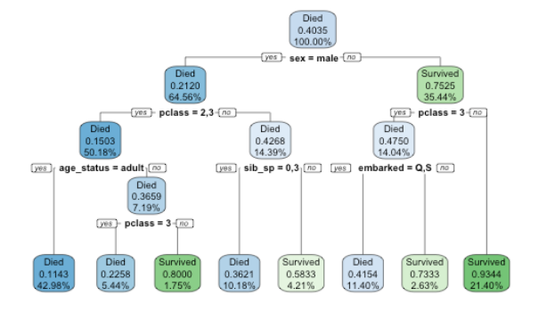

---
output:
  html_document:
    code_folding: hide
  html_notebook: default
  pdf_document: default
---

# Homework week 11 day 2 - passengers on the Titanic

## Read in data
```{r, warning = F, message = F}
library(rpart)
library(rpart.plot)
library(tidyverse)
library(janitor)

titanic_set <- read_csv('data/titanic_decision_tree_data.csv')

shuffle_index <- sample(1:nrow(titanic_set))

# shuffle the data so class order isn't in order - need this for training/testing split later on 
titanic_set <- titanic_set[shuffle_index, ]
```

## Create clean dataset
```{r, warning = F, message = F}
titanic_clean <- titanic_set %>%
  filter(!is.na(survived),
         !is.na(age),
         !is.na(embarked)) %>% 
  mutate_if(is.character, as.factor) %>% 
  mutate(sib_sp = as.factor(sib_sp)) %>% 
  mutate(pclass = as.factor(pclass)) %>% 
  mutate(parch = as.factor(parch)) %>% 
  mutate(survived = if_else(survived == 1, "Survived", "Died")) %>% 
  mutate(age_status  = case_when(age <= 16 ~ "child",
                                 age > 16 ~  "adult",
                                 TRUE ~ NA_character_)) %>% 
  mutate(survived = as.factor(survived)) %>% 
  mutate(age_status = as.factor(age_status)) %>% 
  select(-c(X1, passenger_id, name, age, ticket, fare, cabin)) 

glimpse(titanic_clean)
```

## Check for NAs
```{r, warning = F, message = F}
titanic_clean %>% 
  summarise(across(.fns = ~sum(is.na(.))))
```
## Visualise cleaned data

Some points to note from the graphs in this section:

As a percentage of the total for the groups below:

  * More adults died than children
  
  * More men died than women
  
  * The lower the passenger class, the more people died

Taking a few example figures from the dataset drives home just how horrific this event was: 

Twenty-nine children aged 12 and under lost their lives in the disaster

The three Palsson children listed below died along with their mother and an older sibling en route to join their father who had [emigrated to the US from Sweden](https://www.encyclopedia-titanica.org/titanic-victim/alma-cornelia-palsson.html)

Houssein Hassan was [travelling without a parent](https://www.geni.com/people/Houssein-Mohamed-Hassan-Albimona/6000000015912251772) - he was on his way to visit them in America. 

```{r, warning = F, message = F}
titanic_set %>% 
  mutate(no_parents_on_board = parch) %>% 
  filter(age <= 12,
         survived == FALSE) %>% 
  select(name, age, no_parents_on_board) %>% 
  arrange(no_parents_on_board, name, age)
```


  
```{r, warning = F, message = F}


# By child/adult
titanic_clean %>% 
  group_by(survived, age_status) %>% 
summarise(number_of_people = n()) %>% 
  ggplot(aes(x = age_status, y = number_of_people, fill = survived)) +
  geom_col(position = "fill") +
  labs(title = "By age")


```

```{r, warning = F, message = F}
# By gender
titanic_clean %>% 
  group_by(survived, sex) %>% 
summarise(number_of_people = n()) %>% 
  ggplot(aes(x = sex, y = number_of_people, fill = survived)) + 
  geom_col(position = "fill") +
  labs(title = "By gender")


```

```{r, warning = F, message = F}
# By passenger class
titanic_clean %>% 
  group_by(survived, pclass) %>% 
summarise(number_of_people = n()) %>% 
  ggplot(aes(x = pclass, y = number_of_people, fill = survived)) + 
  geom_col(position = "fill") +
  labs(title = "By passenger class")


```

```{r, warning = F, message = F}
# By embarkation point
titanic_clean %>% 
  group_by(survived, embarked) %>% 
summarise(number_of_people = n()) %>% 
  ggplot(aes(x = embarked, y = number_of_people, fill = survived)) + 
  geom_col() +
  labs(title = "By point of embarkation")


```

```{r, warning = F, message = F}
# Children who were not accompanied by a parent
titanic_clean %>% 
  filter(age_status == "child") %>%
  filter(parch == "0") %>% 
  group_by(survived) %>% 
summarise(number_of_children = n()) %>% 
  ggplot(aes(x = survived, y = number_of_children)) + 
  geom_col() +
  labs(title = "Children not accompanied by a parent")


```

## Model


### Create test/train datasets
I'm using 20% of my data to train the model
```{r}
# Total number of rows
n_data <- nrow(titanic_clean)

# Select 20%  sample
test_index <- sample(1:n_data, size = n_data * 0.2)

# Create test set
titanic_test <- slice(titanic_clean, test_index)

# Create training set
titanic_train <- slice(titanic_clean, -test_index)


```

## Check test/train have similar proportions
Both have roughly a 40/60 split for the number of people who survived the disaster. 
```{r}
titanic_test %>% 
  tabyl(survived)
```

```{r}
titanic_train %>% 
  tabyl(survived)
```

## Build tree model using training dataset

```{r}
titanic_fit <- rpart(
  formula = survived ~ ., 
  data = titanic_train, 
  method = 'class'
)

rpart.plot(titanic_fit, 
           yesno = 2, 
           fallen.leaves = TRUE, 
           faclen = 6, 
           digits = 4)
```

## Screenshot of the model and notes


Based on this screenshot taken the first time I ran the model:

* The model has chosen the following variables:
  * sex
  * pclass(passenger class)
  * age_status (adult/child)
  * embarked(point of embarkation - Cherbourg, Queenstown or Southampton)
  * sib_sp (number of siblings / spouses aboard the Titanic)
  
* Male passengers had a 0.21 chance of dying

I'm not really sure how to inrepret the data in the decision tree so I'll leave it there.
